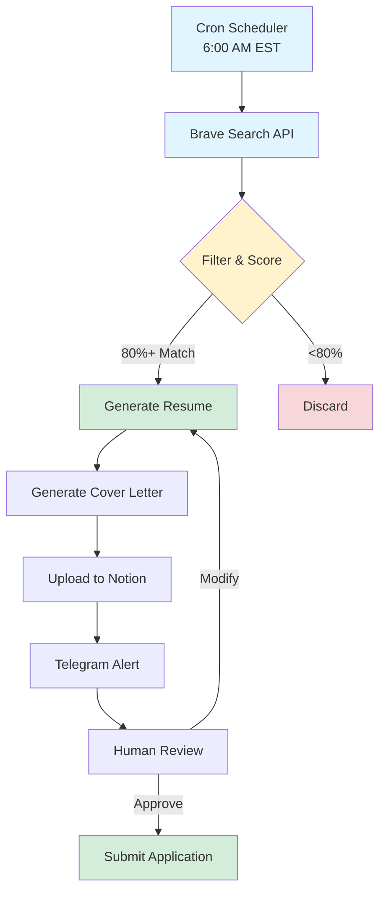

# Architecture Diagram

## Mermaid Diagram (for rendering)



## ASCII Art (for text-only)

```
                    ┌─────────────────┐
                    │  CRON SCHEDULER │
                    │   6:00 AM EST   │
                    └────────┬────────┘
                             │
                             ▼
                    ┌─────────────────┐
                    │  BRAVE SEARCH   │
                    │     API         │
                    └────────┬────────┘
                             │
                             ▼
                    ┌─────────────────┐
                    │  FILTER & SCORE │
                    │   (80%+ match)  │
                    └────────┬────────┘
                             │
              ┌──────────────┼──────────────┐
              │              │              │
              ▼              │              ▼
     ┌─────────────────┐     │     ┌─────────────────┐
     │  DISCARD        │     │     │  GENERATE       │
     │  (<80% match)   │     │     │  RESUME         │
     └─────────────────┘     │     └────────┬────────┘
                             │              │
                             │              ▼
                             │     ┌─────────────────┐
                             │     │  GENERATE       │
                             │     │  COVER LETTER   │
                             │     └────────┬────────┘
                             │              │
                             │              ▼
                             │     ┌─────────────────┐
                             │     │  UPLOAD TO      │
                             │     │  NOTION         │
                             │     └────────┬────────┘
                             │              │
                             │              ▼
                             │     ┌─────────────────┐
                             └────▶│  TELEGRAM       │
                                   │  ALERT          │
                                   └────────┬────────┘
                                            │
                                            ▼
                                   ┌─────────────────┐
                                   │  HUMAN REVIEW   │
                                   │  & APPROVAL    │
                                   └────────┬────────┘
                                            │
                                            ▼
                                   ┌─────────────────┐
                                   │  SUBMIT         │
                                   │  APPLICATION    │
                                   └─────────────────┘
```

## Component Details

### Input
- **Target Role:** Entry-level Data Analyst
- **Location:** Atlantic Canada (NS, NB, PEI, NL)
- **Experience:** 1-2 years
- **Schedule:** Daily at 6:00 AM EST

### Processing
- **Search:** Brave Search API (2000 queries/month free)
- **Scoring:** AI-powered match algorithm
  - Location: 40%
  - Skills: 30%
  - Company: 20%
  - Salary: 10%
- **Generation:** OpenRouter LLM (Kimi K2.5)
- **Templates:** HTML → PDF conversion

### Output
- **Tracking:** Notion database
- **Alert:** Telegram bot notification
- **Package:** Resume + Cover Letter PDFs

### Human Gate
- ✅ Review tailored content
- ✅ Modify if needed
- ✅ Approve before submission
- ❌ No auto-submit (privacy/safety)

---

*Diagram version: 1.0*
*Last updated: Feb 12, 2026*
